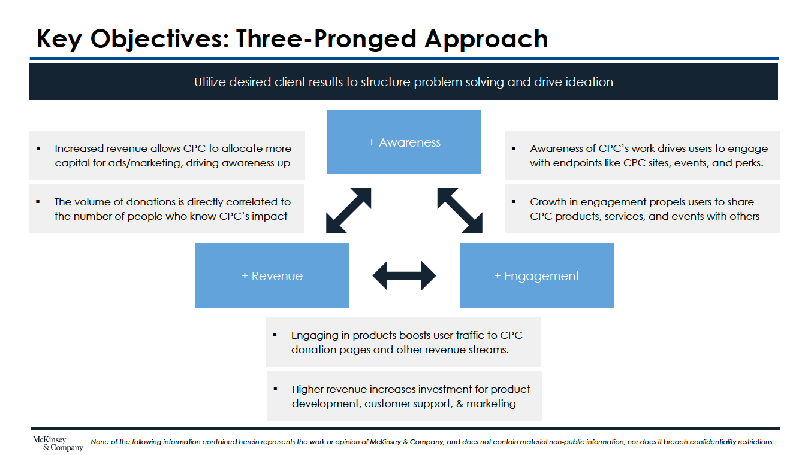
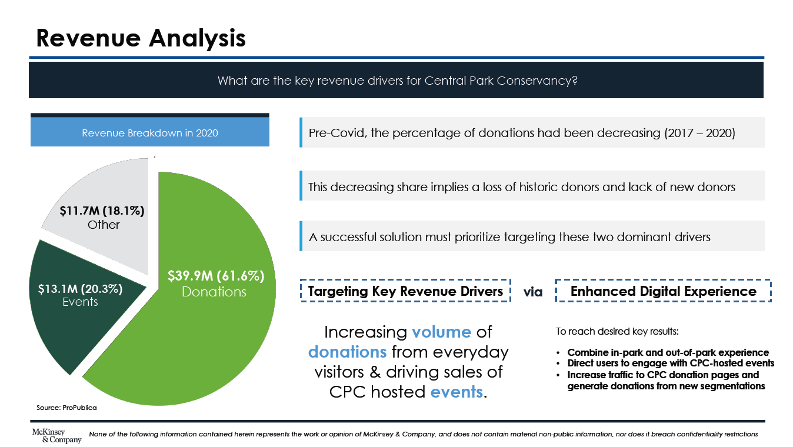
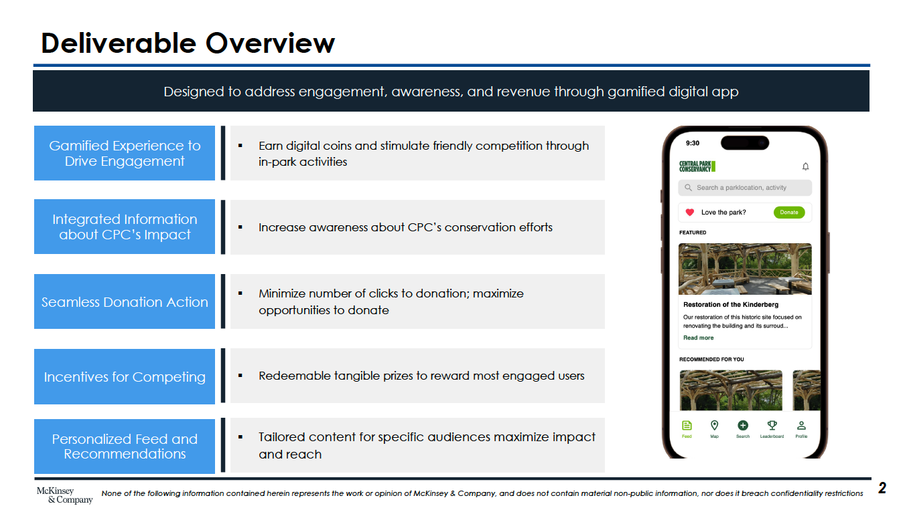

# McKinsey Digital Hackathon 2023

## Background

In the inagural North America McKinsey Digital Hackathon, my team and I solved a business situation faced by a real-world NGO, Central Park Conservancy (CPC). CPC is responsible for the daily care of Central Park, but most people think the Park is cared for by the city. CPC taksed us with creating a digital experienced to address their main objectives: increasing revenue, driving awareness, and improving visitor engagement.

  

## Analysis and Planning

Before creating a solution, we thoroughly investigated the conditions of CPC. This included a revenue analysis, and based on this data, our focus was on driving revenue through an increase in the volume of donations from everyday visitors and an increase in ticket sales of CPC hosted events.

  

## Deliverable

We developed a minimum viable product (MVP) with key attributes:

  

## Softwares and Technologies

  
  
  

